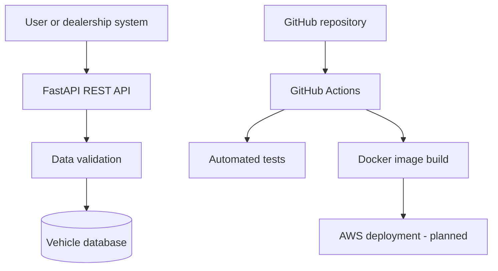

# DealerOps Cloud Platform

[](https://github.com/vithusanvara/DealerOps-Cloud/actions/workflows/ci.yml)


A cloud-focused dealership inventory platform demonstrating modern DevOps practices, automated testing, containerization and infrastructure automation.

The project combines my automotive industry experience with software engineering and AWS cloud development.

> **Project status:** Active development. The application and CI foundation are functional; AWS infrastructure, monitoring and recovery features are planned.

## Project Purpose

Dealership teams need a reliable way to manage vehicle inventory across multiple environments. DealerOps Cloud is being built to demonstrate how a dealership inventory service can be:

- Delivered through a REST API
- Packaged consistently with Docker
- Tested automatically after every code change
- Deployed securely to AWS
- Monitored for reliability and availability
- Recreated using infrastructure as code
- Backed up and restored through documented recovery procedures

## Current Features

- FastAPI REST application
- Application health-check endpoint
- Create and retrieve vehicle inventory
- Vehicle data validation with Pydantic
- Persistent SQLite storage with SQLAlchemy
- Duplicate-VIN protection
- Automated API testing with Pytest
- Docker container configuration
- GitHub Actions continuous integration
- Automated Docker-image validation

## Technology Stack

| Category | Technology |
|---|---|
| Programming | Python 3.12 |
| API framework | FastAPI |
| Validation | Pydantic |
| Database | SQLite and SQLAlchemy |
| Testing | Pytest and FastAPI TestClient |
| Containerization | Docker |
| CI/CD | GitHub Actions |
| Cloud target | Amazon Web Services |
| Infrastructure target | Terraform |
| Version control | Git and GitHub |

## System Design



## API Endpoints

| Method | Endpoint | Purpose |
|---|---|---|
| `GET` | `/` | Display application status |
| `GET` | `/health` | Support container and cloud health checks |
| `GET` | `/vehicles` | Retrieve stored vehicles |
| `POST` | `/vehicles` | Validate and create a vehicle |

FastAPI also generates interactive API documentation automatically:

- Swagger UI: `/docs`
- ReDoc: `/redoc`

## Example Vehicle Request

```json
{
  "year": 2024,
  "make": "Toyota",
  "model": "Corolla",
  "vin": "2T1BURHE0RC123456",
  "price": 29995.00,
  "status": "available"
}
```

## Continuous Integration

Every push and pull request to the `main` branch triggers the GitHub Actions workflow.

The workflow:

1. Creates a temporary Ubuntu environment
2. Checks out the repository
3. Installs Python 3.12
4. Installs the project dependencies
5. Runs the automated test suite
6. Builds the Docker image

This process helps detect application or container errors before deployment.

## Run Locally with Python

```bash
git clone https://github.com/vithusanvara/DealerOps-Cloud.git
cd DealerOps-Cloud

python -m venv .venv
```

Activate the environment on Windows:

```powershell
.venv\Scripts\activate
```

Install dependencies and start the application:

```bash
pip install -r requirements.txt
uvicorn app.main:app --reload
```

Open the API documentation at:

```text
http://127.0.0.1:8000/docs
```

## Run with Docker

Build the container image:

```bash
docker build -t dealerops-cloud .
```

Start the container:

```bash
docker run --name dealerops-api -p 8000:8000 dealerops-cloud
```

Open:

```text
http://localhost:8000/docs
```

## Repository Structure

```text
DealerOps-Cloud/
├── .github/
│   └── workflows/
│       └── ci.yml
├── app/
│   ├── __init__.py
│   ├── database.py
│   ├── main.py
│   ├── models.py
│   └── schemas.py
├── tests/
│   └── test_main.py
├── Dockerfile
├── requirements.txt
├── LICENSE
└── README.md
```

## Development Roadmap

- [x] Create the FastAPI application
- [x] Add application health checks
- [x] Add automated API tests
- [x] Configure GitHub Actions CI
- [x] Package the application with Docker
- [x] Add SQLAlchemy database support
- [ ] Complete persistent CRUD test coverage
- [ ] Add update and delete operations
- [ ] Add PostgreSQL support
- [ ] Provision AWS networking with Terraform
- [ ] Store Docker images in Amazon ECR
- [ ] Deploy the application to Amazon ECS Fargate
- [ ] Add an Application Load Balancer
- [ ] Configure IAM using least-privilege access
- [ ] Store configuration securely
- [ ] Add CloudWatch logs, metrics and alarms
- [ ] Document backup and recovery testing
- [ ] Add an architecture diagram and deployment evidence

## Engineering Goals

The completed platform will demonstrate practical experience with:

- Cloud architecture
- Infrastructure as code
- CI/CD automation
- Containerized application delivery
- Secure networking
- Monitoring and operational reliability
- Business continuity and disaster recovery

## Author

**Vithusan Varatharajan**

Software Engineering Technician student at Centennial College, AWS Certified Cloud Practitioner and AWS Solutions Architect Associate candidate.

[GitHub Profile](https://github.com/vithusanvara)

## License

This project is available under the MIT License.
